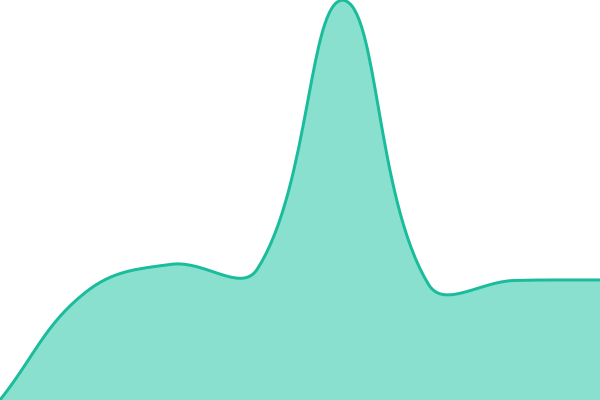
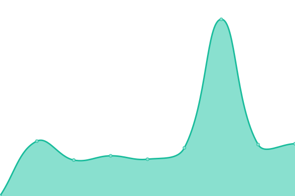

# [📈 Live Status](https://Altyrasolutionslda.github.io/Uptime-Monitor): <!--live status--> **🟧 Partial outage**

This repository contains the open-source uptime monitor and status page for [Altyra Solutions](https://altyra.com), powered by [Upptime](https://github.com/upptime/upptime).

With [Upptime](https://upptime.js.org), you can get your own unlimited and free uptime monitor and status page, powered entirely by a GitHub repository. We use [Issues](https://github.com/Altyrasolutionslda/Uptime-Monitor/issues) as incident reports, [Actions](https://github.com/Altyrasolutionslda/Uptime-Monitor/actions) as uptime monitors, and [Pages](https://Altyrasolutionslda.github.io/Uptime-Monitor) for the status page.

<!--start: status pages-->
<!-- This summary is generated by Upptime (https://github.com/upptime/upptime) -->
<!-- Do not edit this manually, your changes will be overwritten -->
<!-- prettier-ignore -->
| URL | Status | History | Response Time | Uptime |
| --- | ------ | ------- | ------------- | ------ |
|  Apormor | 🟩 Up | [apormor.yml](https://github.com/Altyrasolutionslda/Uptime-Monitor/commits/HEAD/history/apormor.yml) | 

 1098ms
     
 | 

<a href="https://Altyrasolutionslda.github.io/Uptime-Monitor/history/apormor">100.00%</a>
    

|  CNCP | 🟩 Up | [cncp.yml](https://github.com/Altyrasolutionslda/Uptime-Monitor/commits/HEAD/history/cncp.yml) | 

 1489ms
     
 | 

<a href="https://Altyrasolutionslda.github.io/Uptime-Monitor/history/cncp">100.00%</a>
    

|  Gestão Campanhas | 🟩 Up | [gestao-campanhas.yml](https://github.com/Altyrasolutionslda/Uptime-Monitor/commits/HEAD/history/gestao-campanhas.yml) | 

 2356ms
     
 | 

<a href="https://Altyrasolutionslda.github.io/Uptime-Monitor/history/gestao-campanhas">100.00%</a>
    

|  Gestão Voluntariado | 🟥 Down | [gestao-voluntariado.yml](https://github.com/Altyrasolutionslda/Uptime-Monitor/commits/HEAD/history/gestao-voluntariado.yml) | 

 0ms
     
 | 

<a href="https://Altyrasolutionslda.github.io/Uptime-Monitor/history/gestao-voluntariado">100.00%</a>
    

|  Natur-Al-Carnes • Gestão | 🟩 Up | [natur-al-carnes-gestao.yml](https://github.com/Altyrasolutionslda/Uptime-Monitor/commits/HEAD/history/natur-al-carnes-gestao.yml) | 

 836ms
     
 | 

<a href="https://Altyrasolutionslda.github.io/Uptime-Monitor/history/natur-al-carnes-gestao">91.82%</a>
    

|  Natur-Al-Carnes • Leilão Online | 🟩 Up | [natur-al-carnes-leilao-online.yml](https://github.com/Altyrasolutionslda/Uptime-Monitor/commits/HEAD/history/natur-al-carnes-leilao-online.yml) | 

 818ms
     
 | 

<a href="https://Altyrasolutionslda.github.io/Uptime-Monitor/history/natur-al-carnes-leilao-online">91.85%</a>
    

<!--end: status pages-->

[**Visit our status website →**](https://Altyrasolutionslda.github.io/Uptime-Monitor)

## 📄 License

- Powered by: [Upptime](https://github.com/upptime/upptime)
- Code: [MIT](./LICENSE) © [Altyra Solutions](https://altyra.com)
- Data in the `./history` directory: [Open Database License](https://opendatacommons.org/licenses/odbl/1-0/)
